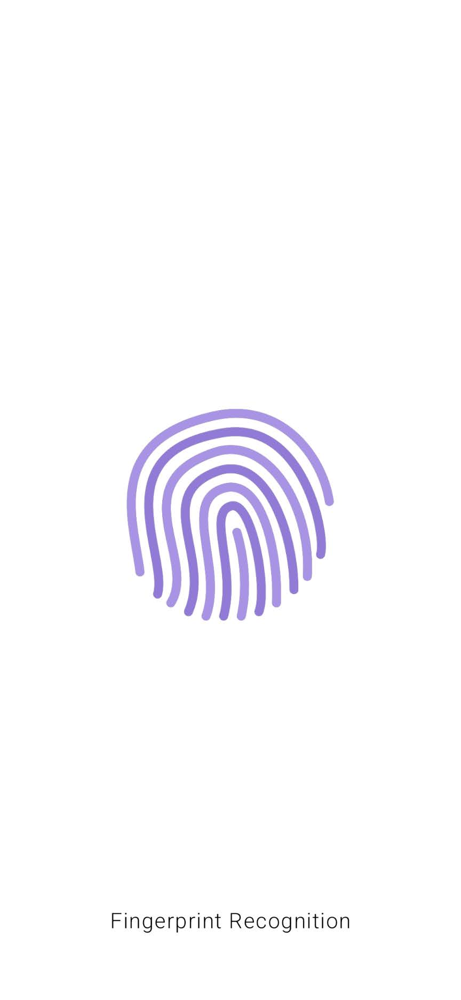
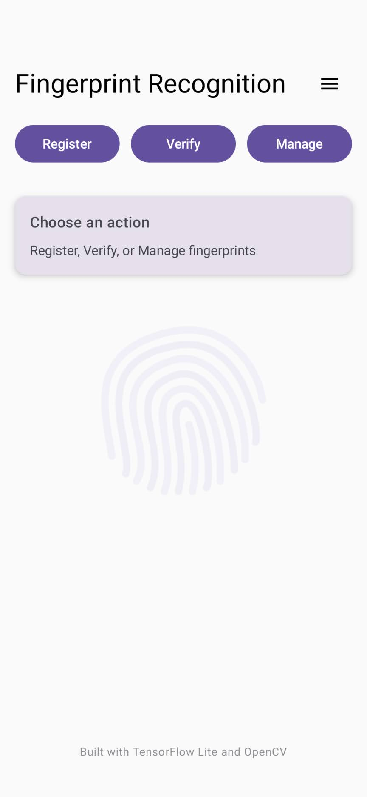
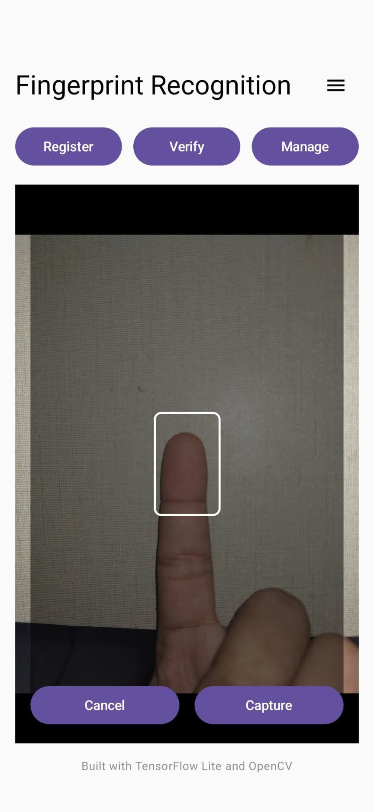
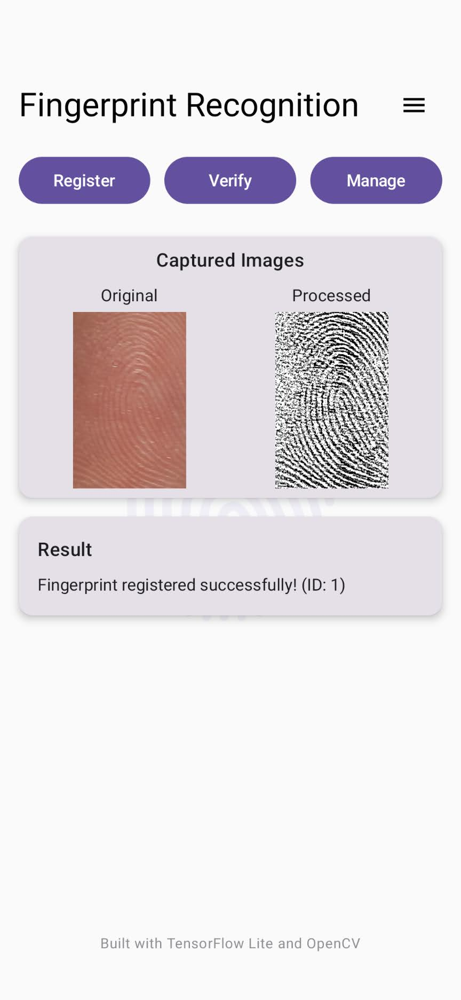
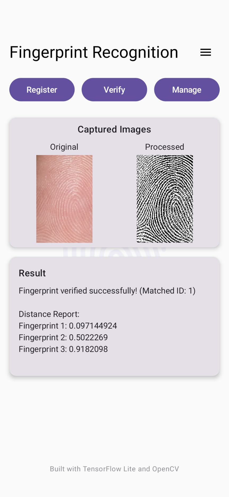
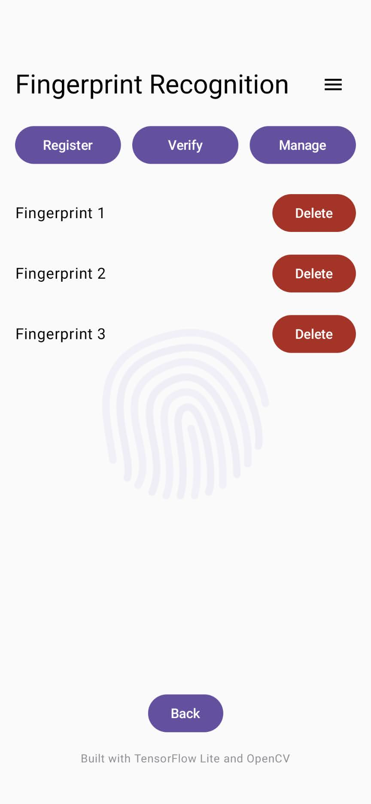

# Fingerprint Recognition: FaceNet Architecture with Contrastive Loss  

This Android application provides an efficient fingerprint recognition system using TensorFlow Lite and OpenCV. Built on a FaceNet-inspired architecture with contrastive loss, it enables users to register, verify, and manage fingerprints directly on their device. The app combines CameraX for fingerprint capture, Jetpack Compose for a modern user interface, and preprocessing techniques such as adaptive thresholding to improve fingerprint clarity and matching performance.

---

## 🚀 Features  

- **Register Fingerprints** – Capture and store fingerprint embeddings for future verification.  
- **Verify Fingerprints** – Compare a captured fingerprint against stored embeddings to identify matches.  
- **Manage Fingerprints** – View and delete registered fingerprints securely.  
- **Camera Integration** – Uses CameraX with flash and autofocus for high-quality fingerprint capture.  
- **Image Processing** – Applies OpenCV preprocessing (grayscale conversion, adaptive thresholding).  
- **Modern UI** – Built with Jetpack Compose; includes a responsive interface, navigation drawer, dialogs, and visual feedback.  
- **Help / About** – Accessible through the navigation drawer for usage guidelines and app information.  

---

## 🖼️ Screenshots

### Splash Screen


### Main Screen


### Registration - Camera Preview


### Registration - Success (Original + Processed)


### Verification Result


### Manage Fingerprints


---

## 🧠 Model Details  

The app uses a TensorFlow Lite model based on the **FaceNet architecture**, trained with **Contrastive loss** on the SOCOFing dataset. The model generates 128-dimensional embeddings for fingerprint comparison. Input images are expected to be 96x96 grayscale images.

### 📊 Training Metrics (from `fingerprint_model_metrics.ipynb`)  

| Metric | Training | Testing |
|---------|----------|---------|
| Accuracy | 98.34% | 98.29% |
| F1 Score | 98.36% | 98.32% |
| Precision | 97.05% | 96.78% |
| Recall | 99.71% | 99.90% |

Confusion Matrices:
```
Training: [[993, 31], [3, 1021]]
Testing:  [[990, 34], [1, 1023]]
```

---

## ⚙️ Build Instructions  

### Prerequisites  
- **Android Studio:** Koala or later  
- **JDK:** 11  
- **Kotlin:** 1.5.1  
- **Android API:** 24+  

### Dependencies  
- Jetpack Compose  
- CameraX (1.3.3)  
- OpenCV (4.5.3.0)  
- TensorFlow Lite (2.14.0)  
- Material Icons Extended  

### Setup  

```bash
git clone https://github.com/Shahzaib3769/Fingerprint-Recognition-FaceNet-Architecture-with-Contrastive-Loss
```  

1. Open in Android Studio and sync Gradle.  
2. Place `siamese_model.tflite` in `app/src/main/assets/`.  
3. Verify permissions in `AndroidManifest.xml`:  

```xml
<uses-permission android:name="android.permission.CAMERA" />
<uses-feature android:name="android.hardware.camera" android:required="true" />
```  

4. Build and run on a device or emulator.  

---

## 📱 Usage  

- **Main Screen:** Three primary actions — Register | Verify | Manage  
- **Register:** Capture and store fingerprint embedding.  
- **Verify:** Compare captured fingerprint against stored ones.  
- **Manage:** View or delete registered fingerprints.  
- **Help / About:** Accessible via navigation drawer with detailed guidance.  

---

## 💡 Camera Tips  

- Ensure good lighting and clean, dry fingers.  
- Center your finger in the guide window.  
- Hold steady during capture to avoid blur.  

---

## ⚠️ Limitations  

- Requires a high-quality camera for accurate capture.  
- Matching can be affected by inconsistent positioning or lighting.  
- Embeddings are stored locally and are not synced across devices.  

---

## 🛠️ Troubleshooting  

- **Camera issues:** Confirm permission and hardware availability.  
- **Model errors:** Ensure `siamese_model.tflite` is correctly placed in `assets/`.  
- **Processing failures:** Review Logcat for detailed error messages.  

---

## 🌟 Future Work  

### 1️⃣ **Extend model training with a mixture of SOCOFing and real-world data**  
Combining SOCOFing with diverse, real-world fingerprint samples would improve model generalization and robustness. Currently, the model is highly tuned to the dataset's characteristics, which may not fully represent variations encountered in uncontrolled environments (e.g., lighting, skin conditions, or sensor noise).  

### 2️⃣ **Add functionality for multiple-angle scans and merge into a composite fingerprint**  
Presently, the app captures and stores a single portion of the fingertip during registration. If the user changes finger angle or orientation during verification, a different portion is captured, leading to possible false negatives or treating the input as a new fingerprint. Supporting multiple-angle captures and merging them would create a more complete and invariant fingerprint representation, reducing sensitivity to finger positioning and improving matching accuracy.  

---

## 📄 License  

This project is licensed under the **MIT License** — see [LICENSE](LICENSE) for details.  
